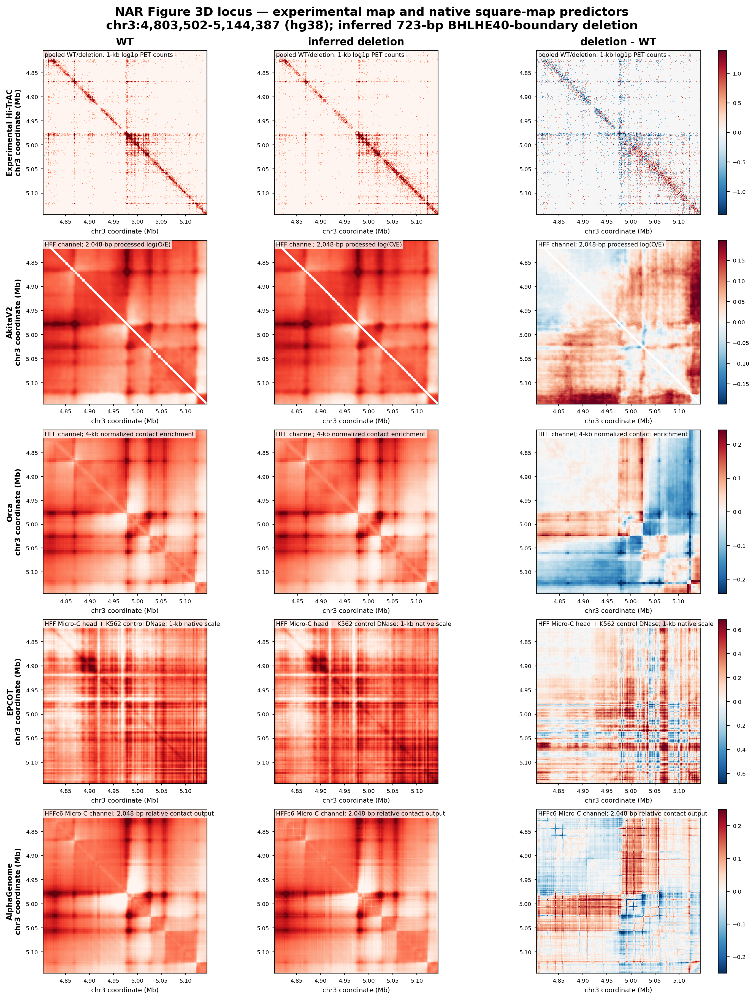

# BHLHE40 native-output perturbation benchmark

This project runs seven released de novo chromatin-contact predictors on the
wild-type and inferred BHLHE40-boundary-deletion sequences corresponding to
Figure 3D of the Hi-TrAC NAR paper. It preserves every model's highest released
native resolution, geometry, cell-type channel and scientific output scale.



## Scientific boundary

The primary comparison is strictly de novo:

- WT: reference DNA plus control K562 DNase where the model accepts accessibility.
- Deletion: inferred deletion DNA plus the same control K562 DNase shifted with
  its attached DNA across the derivative-chromosome junction.

The deletion is the 723-bp clean **SpCas9 cut-to-cut** interval inferred from the
two published guides, hg38 `chr3:4,976,067-4,976,790` in 0-based half-open
coordinates. Both guides map uniquely to hg38 with valid reverse-strand NGG
PAMs. The paper and all nine supplemental tables do not provide a clone-resolved
junction sequence, so this must not be called the exact experimental allele.

An additional EPCOT/ChromaFold sensitivity analysis replaces accessibility with
experimental deletion Hi-TrAC 1D rank-matched to the control-DNase distribution.
It is target-assisted, not de novo, and is ineligible for model ranking.

## Models and native outputs

| Model | Primary channel | Native resolution | Native output |
|---|---|---:|---|
| AkitaV2 | HFF | 2,048 bp | processed log(O/E), upper triangle |
| DeepC | K562 | 5 kb | normalized center-anchored poles |
| Orca | HFF | 4 kb | normalized contact-enrichment matrix |
| EPCOT | HFF Micro-C head + K562 DNase | 1 kb | model-native predicted O/E matrix |
| ChromaFold motif | motif/no-coaccess + K562 DNase proxy | 10 kb | HiC-DC+ Z-score V-stripes |
| AlphaGenome | HFFc6 Micro-C | 2,048 bp | relative-contact matrix |
| Chimaera | generic human release | 2,048-bp position axis | standardized log-distance-residual image |

None of these outputs is an absolute PET-count prediction.

## Reproduce the local audit and figures

After placing the generated native products under `results/native/` and the
registered common input bundle under `results/inputs/`:

```bash
python scripts/audit_all_outputs.py
python scripts/render_native_figure3d.py
```

The model-specific launchers are under `scripts/`. Checkpoints and large input
tracks are deliberately excluded from Git; `scripts/download_resources.sh`
retrieves the public releases that support direct download.

## Outputs

- [Scientific report](SCIENTIFIC_REPORT.md)
- [Completion audit](results/COMPLETION_AUDIT.md)
- [Model/input/output audit](results/MODEL_INPUT_OUTPUT_AUDIT.csv)
- [All native outputs](figures/FIGURE3D_ALL_NATIVE_OUTPUTS.png)
- [Square-map outputs](figures/FIGURE3D_DENSE_NATIVE_OUTPUTS.png)
- [Pole, V-stripe and rotated outputs](figures/FIGURE3D_NON_SQUARE_NATIVE_OUTPUTS.png)
- [Input tracks](figures/FIGURE3D_LOCUS_AND_INPUT_TRACKS.png)
- [Target-assisted sensitivity analysis](figures/FIGURE3D_TARGET_ASSISTED_NOT_DENOVO.png)
- [Gviz ideogram, audited locus tracks and historical K562.hic map](figures/GVIZ_K562_HIC_BHLHE40_FIGURE3D.png)
- [Deletion breakpoint re-audit](results/DELETION_BREAKPOINT_REAUDIT.md)
- [K562.hic extraction audit](results/k562_hic/K562_HIC_FIGURE3D_AUDIT.json)

## Primary sources

- [Hi-TrAC BHLHE40 deletion paper](https://academic.oup.com/nar/article/51/12/6172/7161543)
- [Akita](https://www.nature.com/articles/s41592-020-0958-x) and [Basenji code](https://github.com/calico/basenji)
- [DeepC](https://www.nature.com/articles/s41592-020-0960-3) and [code](https://github.com/Hughes-Genome-Group/deepC)
- [Orca](https://www.nature.com/articles/s41588-022-01065-4) and [code](https://github.com/jzhoulab/orca)
- [EPCOT](https://pmc.ncbi.nlm.nih.gov/articles/PMC10325920/) and [code](https://github.com/liu-bioinfo-lab/EPCOT)
- [ChromaFold](https://www.nature.com/articles/s41467-024-53628-0) and [code](https://github.com/viannegao/ChromaFold)
- [AlphaGenome](https://www.nature.com/articles/s41586-025-10014-0) and [API/code](https://github.com/google-deepmind/alphagenome)
- [Chimaera](https://doi.org/10.1093/nar/gkaf1516) and [code](https://github.com/ashkolikov/chimaera)
